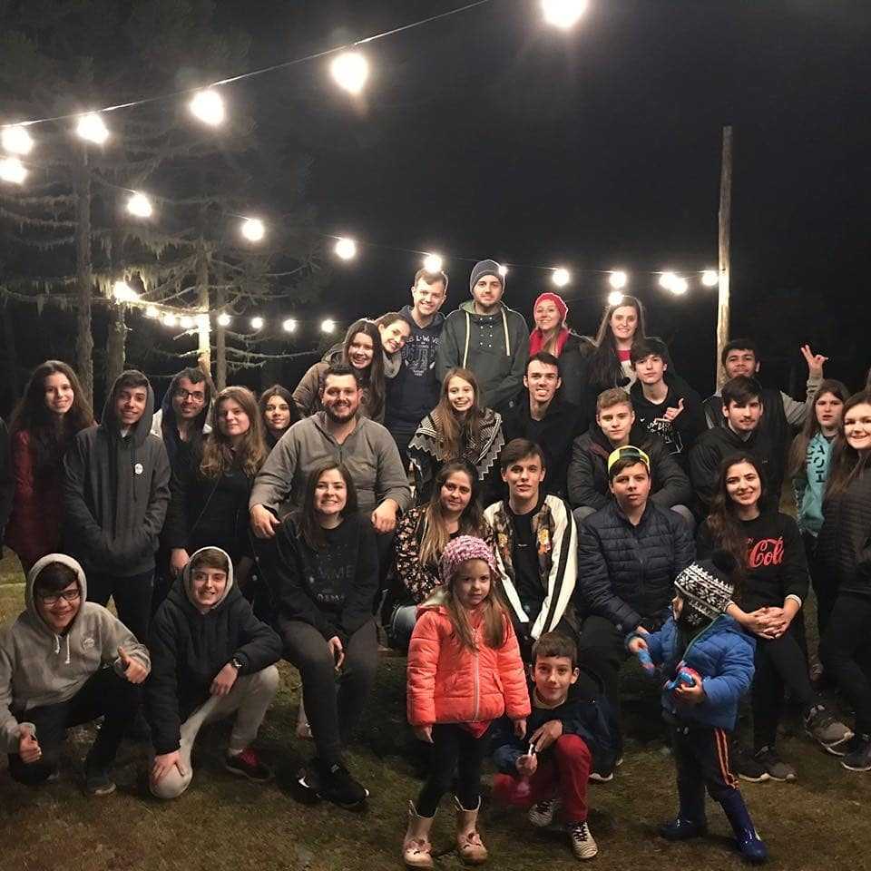

Curso de Inglês Incompleto realizado no período de 2017 a 2019 até metade do módulo avançado!

Experiência:

Viagem junto a FISK para [Snow Valley](https://www.facebook.com/snowvalleyexperiencepark/) pra aperfeiçoar a comunicação na língua!

