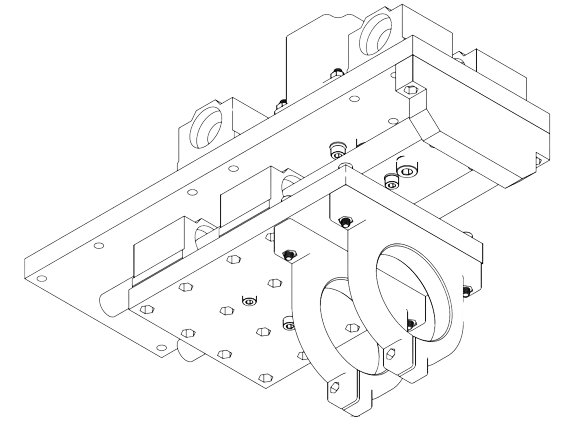
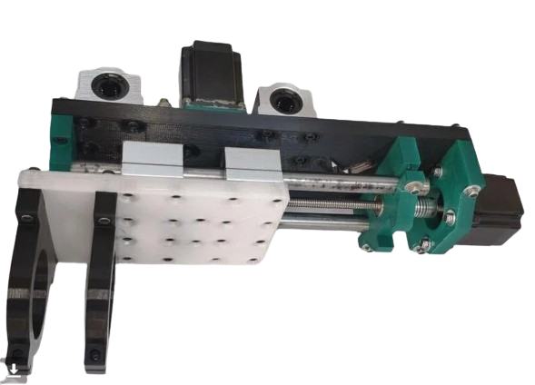
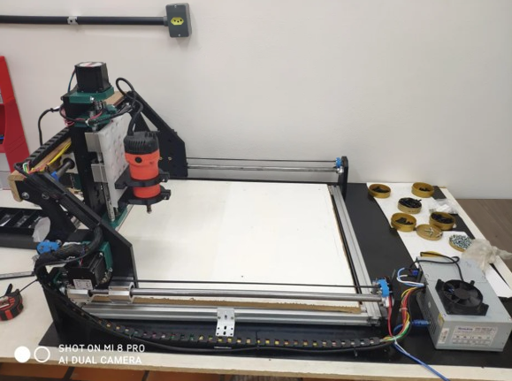

Estágiario em [Imaginum3D](https://www.facebook.com/imaginum3d/)

Primeira experiência como estágiario. Nele aprendi a elaborar e desenvolver projetos elétricos de padrão de entrada - CELESC e participei, junto a empresa, de uma competição internacional de montagem de máquinas 3D e de corte CNC.

Projetos realizados:

- [Projeto de Router CNC](https://www.instructables.com/3D-Printed-500x400mm-Router-CNC/). O projeto surgiu com a ideia de participar da competição INSTRUCTABLES, a elaboração e desenvolvimento estão todas descritas no site bem como as animações feita em FUSION 360 - AutoDesk - instructables em inglês!

- Elaboração de Projetos de padrão de entrada residenciais elétricos - AutoCAD - AutoDesk!

- Por fim deixo meus agradecimentos pessoais ao Guilherme Maximiliano Negri, dono da empresa, que me deu a oportunidade e foi uma das pessoas em minha vida com quem mais aprendi!