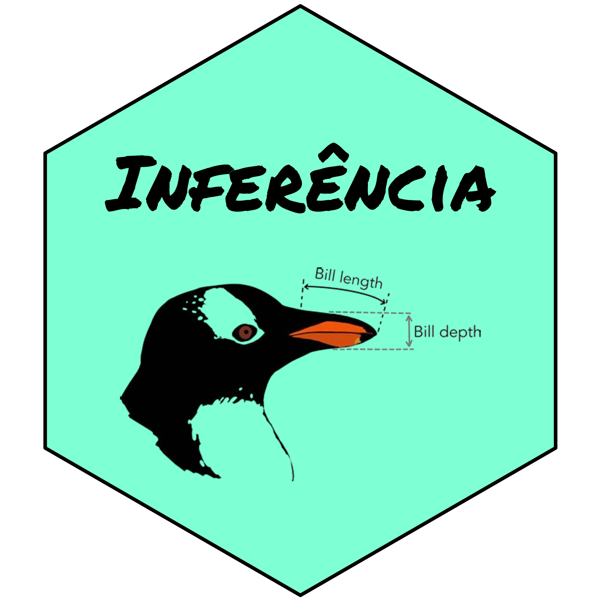

## O Trabalho trata sobre uma análise de um banco de dados que contém observações de penguins na Antártica!

---

### Sobre o trabalho

Análise do banco de dados contém 344 observações coletadas e disponibilizadas pela Dra. Kristen Gorman e pela Estação Palmer, Antártica, LTER (Long Term Ecological Research), membro da Rede de Pesquisa Ecológica de Longo Prazo. 

### Conceitos:

Nesse trabalho aplicamos os conceitos compreendidos em sala de aula. Nele consta:

✔️Resumo do Banco de dados

✔️Análise Descritiva

✔️Intervalo de Confiança

✔️Teste de Hipótese

O trabalho Inteiro foi realizado em R e Quarto!

### Acesso ao trabalho

O trabalho está disponível no [github](https://github.com/davi-dokasi/palmer-penguins-research?tab=readme-ov-file) ou acessando o [site](https://nimrodds.quarto.pub/club-penguin-palmer-penguins/#/introdu%C3%A7%C3%A3o).
